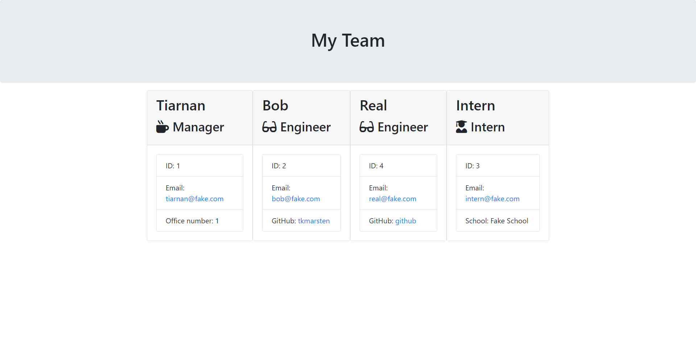

# Team Profile Generator

## Description

A webpage generator that generates a project team based on user input. This project utilizes `Node.js` and the `inquirer` package to ask the user for input and generate HTML accordingly.

## Installation

Use the command `npm i` to install the required packages.

## Usage

Use the command `node index.js` or `nodemon` to run the program. After running the commands, the user will be prompted with questions in the terminal.

A demo of the program in use can be found [here](https://youtu.be/poPTNrtc2UE).

## Contribution

Tiarnan Marsten

## License

